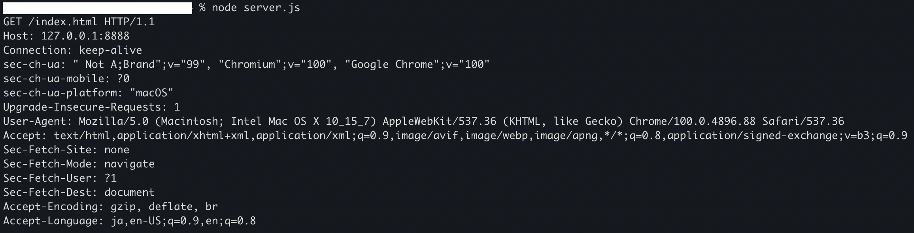
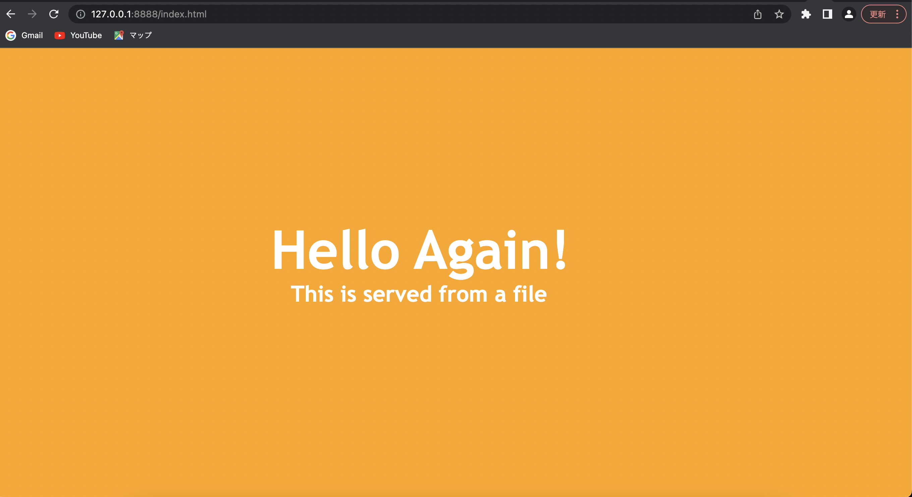

# A simple http server 
I implement a simple http server from scratch. The http sever processes GET method. I write the http server program while reading RFC. Then I found 3 ways to judge an end of a response.
Firstly, a connection between a server and a client closed. Secondly, the server specifies the size of the message body in the Content-Length header. Thirdly, in chunk transfer The chunked encoding is ended by any chunk whose size is 0.
I learned a lot from that.

# Screenshot
Request message

When you access from a browser 

